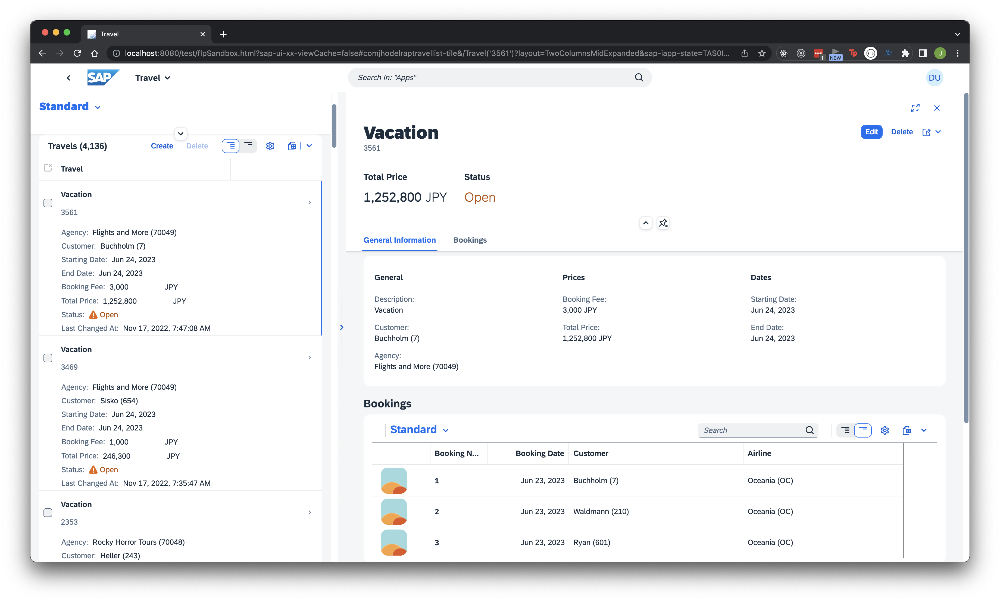

# SAP Fiori Elements ile Seyahat Uygulaması Oluşturun

SAP Business Technology Platform deneme hesabınızı ve SAP Business Application Studio'yu kullanarak bir liste raporu nesne sayfası uygulaması oluşturun. Uygulama, ABAP Geliştirme Araçları ortamında SAP ABAP RESTful Uygulama Programlama Modeli (RAP) ile oluşturulmuş bir OData V4 hizmetini temel alır. Kullanıcı arabirimi ek açıklamalarını kullanarak ve Esnek Programlama Modelinden yararlanarak kullanıcı arabirimini ihtiyaçlarınıza göre nasıl ayarlayacağınızı öğrenin.

Bknz: [Create a Travel App with SAP Fiori Elements Based on OData V4 RAP Service](https://developers.sap.com/group.fiori-tools-odata-v4-travel.html)

- Uygulamayı çalıştırın

```shell kod
> cd app/travellist
> npm start
```



## BTP ABAP HAVUZUNA YERLEŞTİRME İŞLEMİ

- Fiori Element uygulamasını BTP ABAP Deposuna dağıtın

```shell kodu
> cd app/travellist
> npm run deploy
```

Bknz [Create a SAP Fiori App in Visual Studio Code and Deploy it to SAP BTP, ABAP Environment](https://developers.sap.com/tutorials/abap-environment-vs-code.html)

## HTML5 UYGULAMA DEPOSUNA DAĞITIM

- Fiori Element uygulamasını HTML5 Uygulama Havuzuna dağıtın

```shell kodu
> npm run build
> npm run deploy
```

Bknz [Create a SAP Fiori App and Deploy it to SAP BTP, Cloud Foundry environment](https://developers.sap.com/tutorials/abap-environment-deploy-cf.html)
